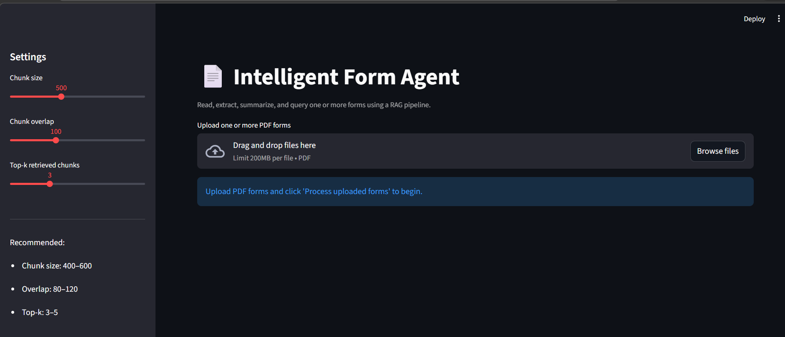
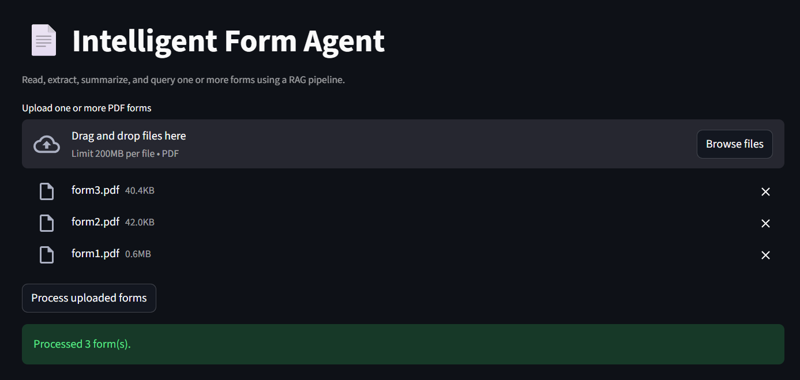
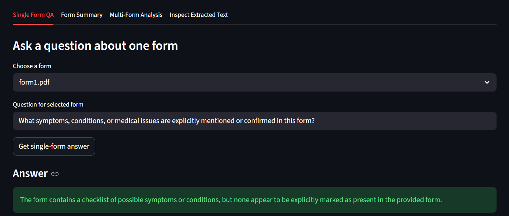
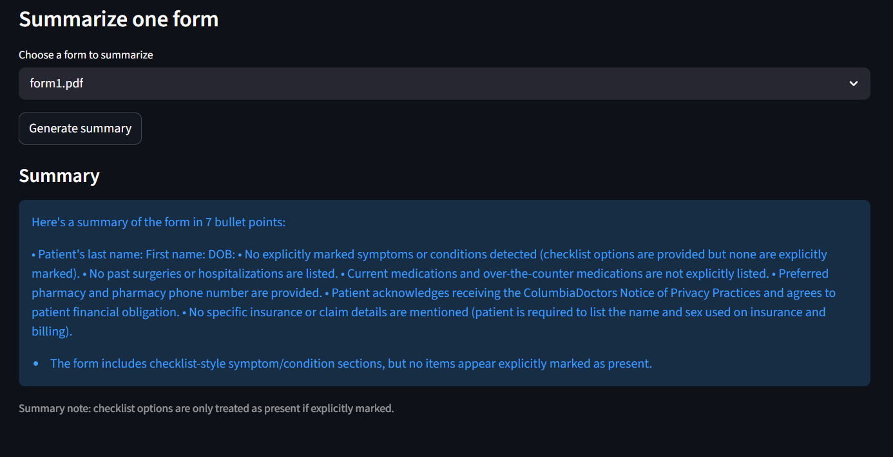

## Intelligent Form Agent

### Overview

**Intelligent Form Agent** is an AI-powered Retrieval-Augmented Generation (RAG) system for analyzing PDF forms such as medical intake, insurance, or registration documents. It extracts text from forms, answers natural language questions, generates concise summaries, and can compare multiple forms to surface cross-form patterns and insights.

---

## Features

- **PDF form text extraction** using `pdfplumber` and related utilities.
- **Question answering over forms** with a RAG pipeline.
- **Automatic form summarization** to highlight key information.
- **Multi-form insights** across several forms at once.
- **Semantic retrieval with FAISS** and sentence-transformer embeddings.
- **Checkbox-aware reasoning** for Y/N and checklist-style fields.
- **Streamlit UI** for interactive exploration.

---

## Architecture

High-level processing pipeline:

`PDF → Text Extraction → Chunking → Embeddings → FAISS Retrieval → LLM Reasoning → Answer / Summary / Insights`

For a detailed component-level explanation, see:

[Architecture Documentation](docs/architecture.md)

---

## Project Structure

```text
intelligent-form-agent/
├── app/
│   └── app.py
├── src/
│   ├── __init__.py
│   ├── extractor.py
│   ├── chunker.py
│   ├── embedder.py
│   ├── retriever.py
│   ├── llm.py
│   ├── form_utils.py
│   ├── qa_agent.py
│   ├── summarizer.py
│   ├── multi_form_agent.py
│   └── demo.py
├── tests/
│   ├── conftest.py
│   ├── chunker_test.py
│   ├── embedder_test.py
│   ├── extractor_test.py
│   ├── retriever_test.py
│   └── llm_test.py
├── docs/
│   ├── architecture.md
│   └── example run.txt
├── requirements.txt
└── README.md
```

- **app/**: Streamlit application and UI entry point.
- **src/**: Core pipeline modules (extraction, chunking, embeddings, retrieval, LLM reasoning, summarization, multi-form analysis, demo).
- **tests/**: Pytest-based tests for core components.
- **docs/**: Additional documentation, including architecture and example runs.
- **requirements.txt**: Python dependencies.

---

## Setup

### 1. Clone the repository

```bash
git clone https://github.com/your-username/intelligent-form-agent.git
cd intelligent-form-agent
```

### 2. Create and activate a virtual environment (Windows)

```bash
python -m venv venv
.\venv\Scripts\Activate
```

### 3. Install dependencies

```bash
pip install -r requirements.txt
```

### 4. Configure environment variables

Create a `.env` file in the project root:

```text
OPENROUTER_API_KEY=your_api_key_here
```

### 5. (Optional) Add sample forms

Create a `data/forms/` directory and place one or more PDF forms inside it, for example:

```text
data/forms/form1.pdf
data/forms/form2.pdf
```

### 6. Run the Streamlit app

```bash
streamlit run app/app.py
```

### 7. (Optional) Run the CLI demo

From the project root:

```bash
python -m src.demo
```

---

## Demo

### Application Interface


### Form Upload


### Question Answering


### Form Summary


---

## Example Use Cases

Example prompts you can run through the UI or agents:

- **Single-form QA**: `What symptoms does the patient report?`
- **Form summarization**: `Summarize this form.`
- **Cross-form analysis**: `What common symptoms appear across these forms?`

The system uses semantic retrieval plus LLM reasoning to answer these in a grounded way based on the underlying form content.

---

## Technologies Used

- **Python** for the end-to-end pipeline.
- **Streamlit** for the web UI.
- **pdfplumber** for PDF text extraction.
- **sentence-transformers** for text embeddings.
- **FAISS (faiss-cpu)** for vector search.
- **LLM API** accessed via `OPENROUTER_API_KEY` for reasoning, QA, and summarization.
- **numpy** for text processing and utilities.
- **python-dotenv** for configuration.
- **pytest** for testing.
